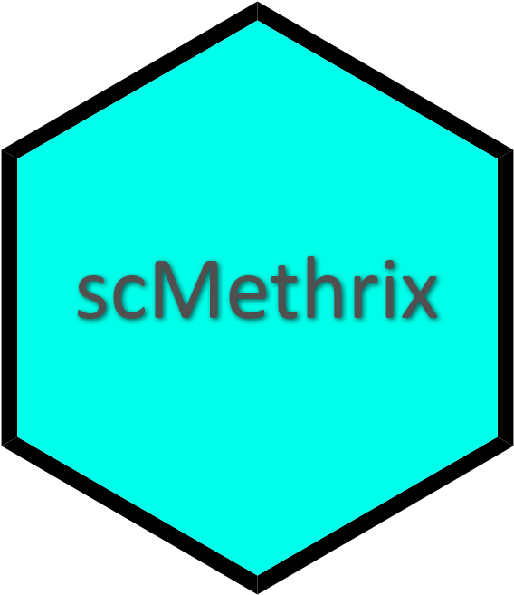

# scMethrix <a href="https://compepigen.github.io/scMethrix/"></a>

## Fast and efficient summarization of generic BedGraph and .IDAT files from single cell bisulfite sequencing

[](https://www.repostatus.org/#wip) [](https://lifecycle.r-lib.org/articles/stages.html#experimental) [](https://github.com/CompEpigen/scMethrix/issues)  
<!--[](https://github.com/CompEpigen/scMethrix/actions) --> [](https://www.gnu.org/licenses/gpl-3.0.en.html) [](https://www.r-project.org/) [](https://github.com/CompEpigen/scMethrix/blob/master/NEWS) [](https://github.com/CompEpigen/scMethrix/blob/master/NEWS)

<!-- [](https://hits.seeyoufarm.com) -->

## Introduction

`scMethrix` is an extension of [`SingleCellExperiment`](https://bioconductor.org/packages/release/bioc/html/SingleCellExperiment.html), and focusing on single-cell methylation data. It provides set of functions which allows easy importing of [BedGraph](https://genome.ucsc.edu/goldenPath/help/bedgraph.html)-like files or raw binary intensity data ([.IDAT](https://www.illumina.com/content/dam/illumina-marketing/documents/products/technotes/technote_array_analysis_workflows.pdf)) generated from methylation microarrays. These files are first aggregated into an experiment object, then processed using numerous internal functions or other downstream analysis tools, and can exported into numerous common file formats for further downstream processing.

A detailed example data analysis is provided in our [vignettes](https://compepigen.github.io/scMethrix/articles/x01_load_data.html). Further examples using external tools are also provided.

## Package overview


## Installation

<!--
``` r
if (!requireNamespace("BiocManager", quietly = TRUE))
    install.packages("BiocManager")
    
#Installing stable version from BioConductor
BiocManager::install("methrix")
```
-->

``` r
#Installing developmental version from GitHub
BiocManager::install("CompEpigen/scMethrix")
```

<!--
***NOTE***

Installation from BioConductor requires the BioC and R versions to be up-to-date. This arises from the restrictions imposed by BioConductor community which might cause package incompatibilities with the earlier versions of R (e.g, R \< 4.0). In that case, installing from GitHub might be easier since it is much more merciful with regards to versions.
-->

## Updates

See [here](https://github.com/CompEpigen/scMethrix/blob/master/NEWS)
